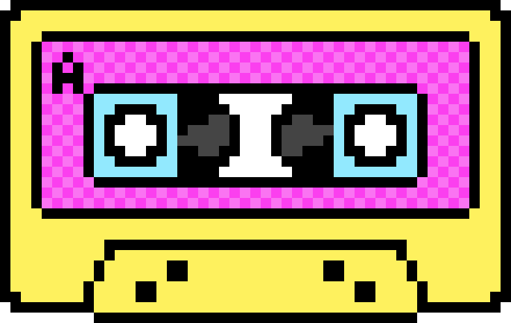
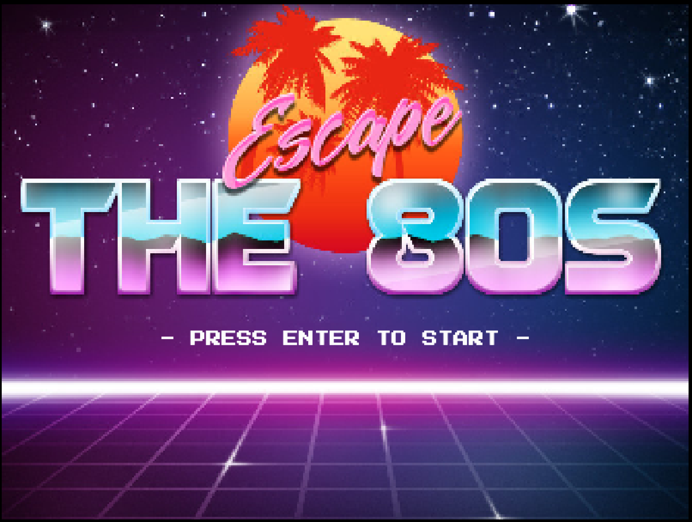
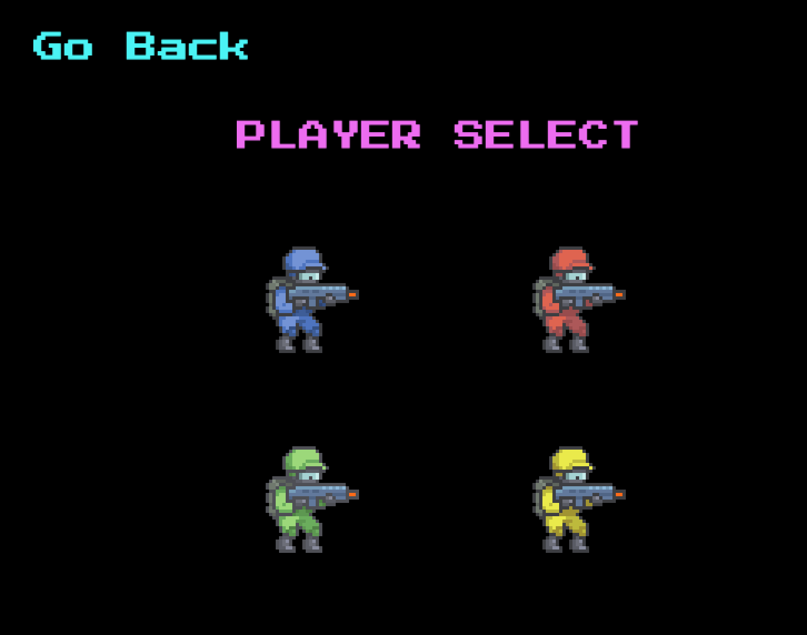
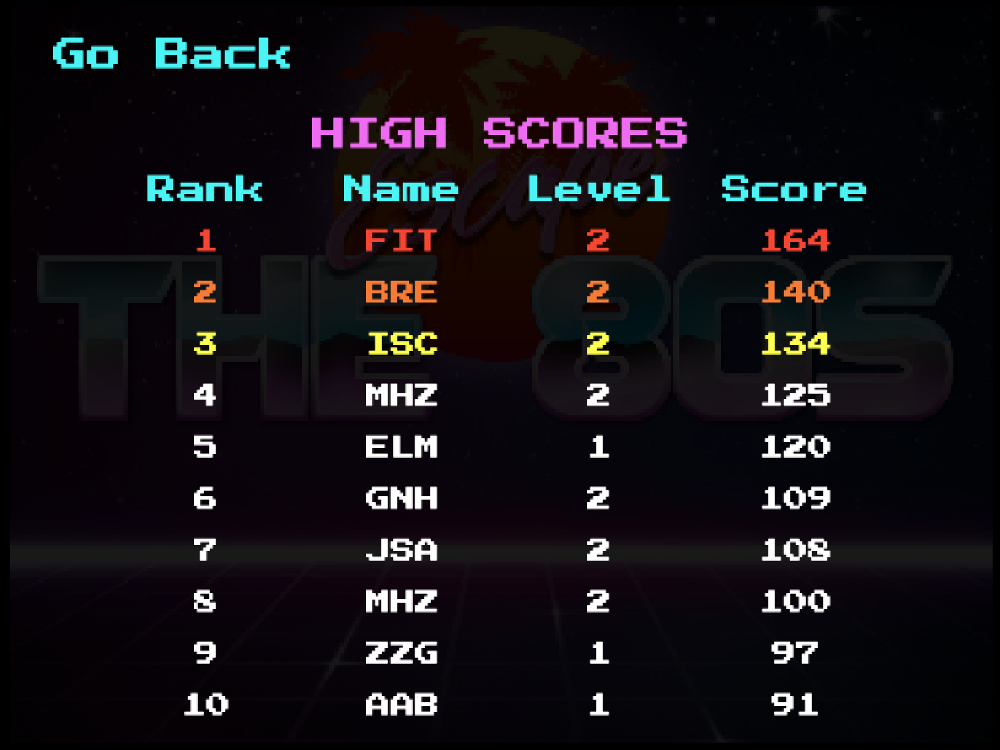
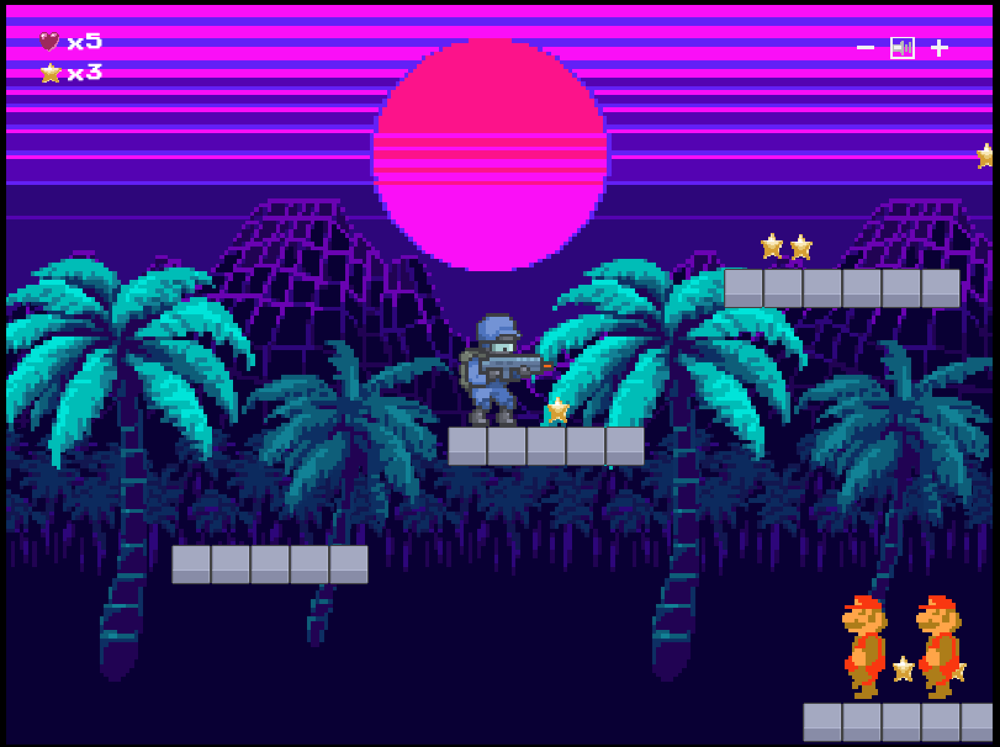
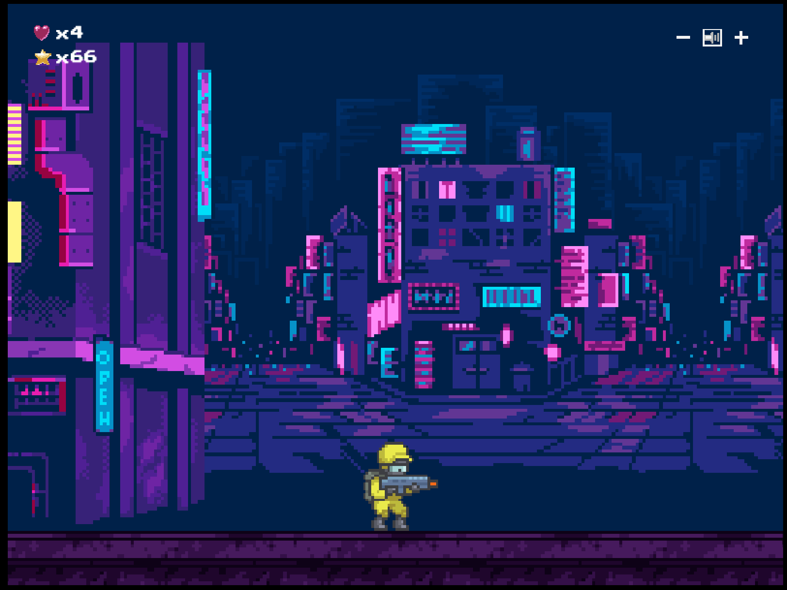
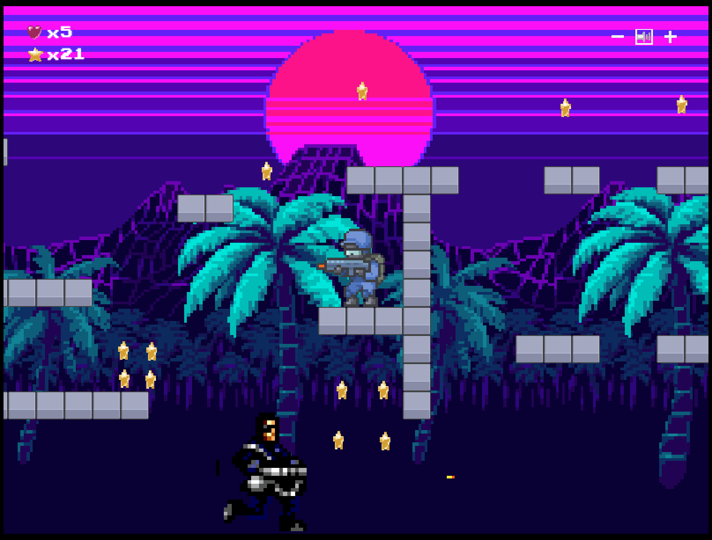

#  Escape the 80s 

## Introduction

<em>Escape the 80s</em> is a web-based side-scrolling game–built using Phaser 3, Redux, Sequelize, and PostgreSQL–with both campaign and multiplayer modes. Players must help Rex Schraeder fight his way back from the 80s if they don't want him to be forever trapped in a world of fanny packs, leg warmers, and neon fashion!

## Checkout the Deployed Game

[Deployed to Heroku](http://escape-the-80s.herokuapp.com/)

## Screenshots

  
  

  
  

  
  

## Getting Started

1. Fork and clone this repo.
2. `npm install`.
3. Create `escape-the-80s` database.
4. Start the build process and your application with: `npm run start-dev`. If you're using Windows, you may need to execute npm run start-server and npm run build-watch separately (in their own terminal tabs).
5. Navigate to `localhost:8080` to see the site in the browser.
6. Check out the starting seed file in `seed.js` - you can run it by executing `npm run seed`. You will need to seed the database once you've set up the Sequelize models.

## Acknowledgements

Special thanks to Ricky Rhodes, Joe Alves, and Hannah Bates and the Regex Spaceship Team (Hope Fourie, Adria Orenstein, and Catalina McQuade).
